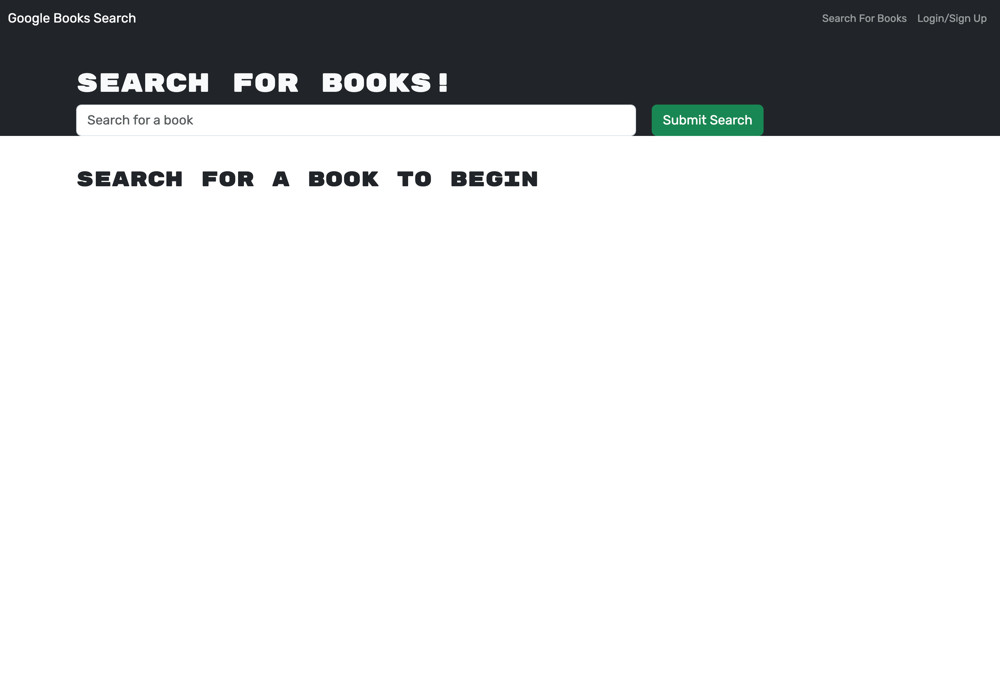

# book-search-engine
An app using the MERN stack, with a React front end, MongoDB database, and Node.js/Express.js server and API that allows users to save book searches to the back end.

## Usage and Installation

To use this application, you can enter in a book title in the search bar. If you would like to save books for future reference, please create an account. You must be logged in to save/view saved books. 

Link to the [deployed application](https://gentle-eyrie-95071-9d78e006c6be.herokuapp.com/).

Screenshot of the application:

## Credits

I received starter code for this application from this [GitHub repository](https://github.com/coding-boot-camp/solid-broccoli). I also received support from a tutor.  

## License

Please refer to the LICENSE in the repo.